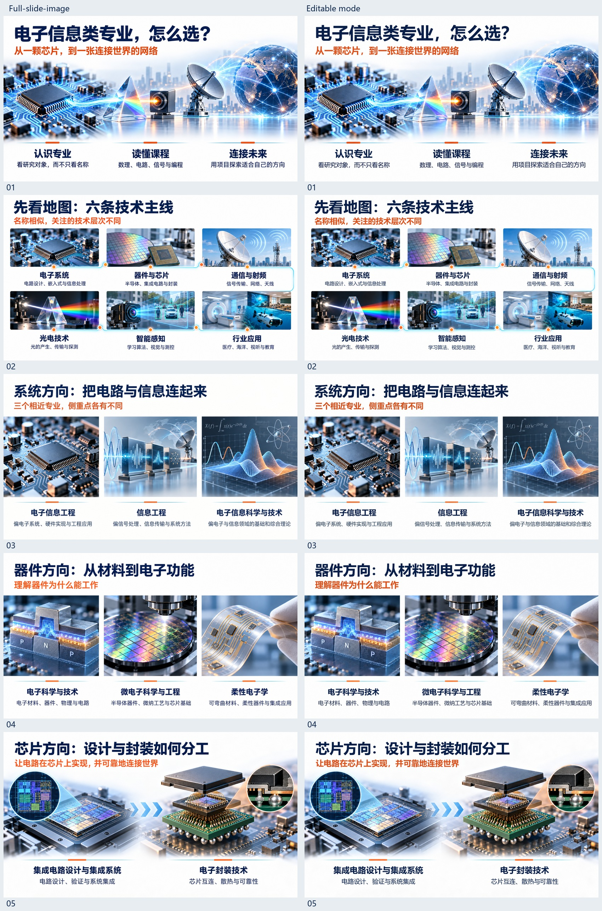
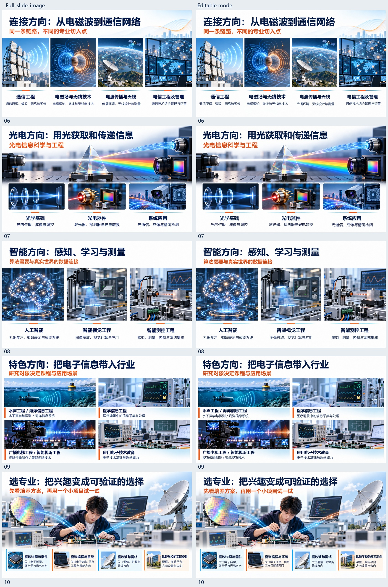

# Current full-slide-first showcase / 新版流程展示

Published / 展示更新：2026-09-22。

主题：《电子信息类专业》。本页使用已交付的 10 页双模式成品，与仓库当前的完整成图、图片模型去字、MCP 还原和渲染对照流程对应。本次为展示更新，不是重新运行生成，也不是对最新提交的无人干预回归测试。

[Full-slide PPTX](https://github.com/xy040427-collab/agent4ppt-skill/releases/download/showcase-full-slide-first-v2/electronics-full-slide-image.pptx) · [Editable PPTX](https://github.com/xy040427-collab/agent4ppt-skill/releases/download/showcase-full-slide-first-v2/electronics-editable-mode.pptx) · [文件核验记录](showcase-current-verification.json)

## All 10 pages / 全部逐页对比

每行左侧为 full-slide 原图，右侧为实际 PowerPoint 可编辑版渲染。点击图片可放大；文字细节请结合下载的 PPTX 检查。

## Verification and limits

- 本次独立读取两份 PPTX 的 OOXML，确认各 10 页及 10 页备注；可编辑版有 90 个原生文字对象，图片版没有原生文字对象。文件 SHA-256 见 JSON。
- 展示图片从原交付目录直接复制，无修图。已目视复核全部 10 页的成对预览；复用了原交付时的 PowerPoint 渲染，没有在本次重新启动 PowerPoint。
- 原交付记录称最终 editable 渲染与验收 checkpoint 相同。这不表示 editable 与 full-slide 原图像素相同，也不能当作字体识别准确率或无人干预成功率。
- 插画、器件、光路等是 AI 概念示意，非精确工程结构或测量图。专业方向以各校培养方案为准。
- 原生文字可改，插画与固定文字仍为栅格；替换成长文案可能需要重新排版。未在本次建立跨软件兼容性或生成耗时基准。
- 本次未上传私人组会内容、运行数据库、凭据或本地任务日志。下载文件作为 Release 附件，未写入 skill 安装目录。

## Historical samples / 历史样例

原有 10 类场景、30 页展示保留在[历史画廊](showcase.md)和 [showcase-v1 Release](https://github.com/xy040427-collab/agent4ppt-skill/releases/tag/showcase-v1)。历史原生图表、表格展示不能用来证明当前内置纯文字还原链路支持这些对象。
